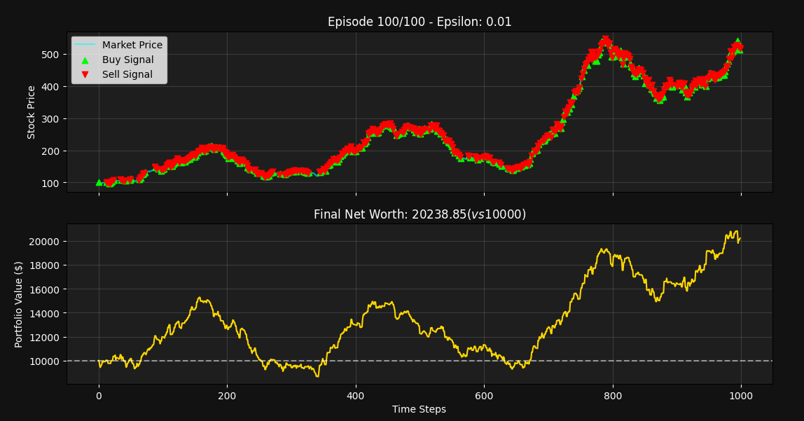

NeuroTrader 🧠📈
================

**NeuroTrader** is a self-contained Deep Reinforcement Learning (DRL) implementation designed to trade on synthetically generated stock market data.

Unlike standard trading bots that use static algorithms (RSI, MACD), NeuroTrader utilizes a **Deep Q-Network (DQN)** to *learn* optimal trading strategies (Buy, Sell, Hold) purely through trial and error within a custom OpenAI Gym-style environment.

✨ Features
----------

-   **Fractal Market Generation:** Uses Geometric Brownian Motion + Seasonality + Fractal Noise to generate unique, realistic, and challenging market conditions every time you run it. No external CSVs or API keys required.

-   **Deep Q-Network (DQN):** Implements a PyTorch-based neural network with:

    -   **Experience Replay:** To break correlation between consecutive training steps.

    -   **Target Networks:** To stabilize training convergence (DeepMind architecture).

    -   **Huber Loss:** For robust error calculation.

-   **Live Visualization:** Real-time Matplotlib dashboard showing the Neural Network's decisions (Buy/Sell signals) and portfolio performance as it learns.

🔬 Performance and Insights
---------------------------

The training process itself provides valuable insights into how Deep Reinforcement Learning agents operate in financial environments:



### 1\. The Exploration Trap (The Initial Fail)

In the first training attempt (low episode count, slow Epsilon decay), the agent failed, turning **$10,000 into $6,994**. This failure highlighted a key challenge in DRL: the **Exploration vs. Exploitation trade-off**. Because the agent took random actions over **90% of the time** (high Epsilon), it engaged in excessive "churn," resulting in its capital being consumed entirely by **transaction fees** (0.1% per trade).

### 2\. The Strategic Success (The Tuned Result)

After adjusting the hyperparameters to aggressively decay the Epsilon value and increase the training episodes, the agent successfully learned a profitable policy, turning **$10,000 into $20,238**.

However, the analysis revealed a strategic lesson:

-   **Agent's Return (2x):** The AI achieved a 102% return.

-   **Buy & Hold Return (5x):** The underlying synthetic market, being a strong bull market, returned over 400%.

The DQN agent became an **aggressive scalper**, trading constantly and failing to capture the massive long-term trend due to the cumulative drag of transaction fees. This mirrors real-world trading challenges, proving the environment is realistic and the reward function requires further optimization to incentivize long-term trend following.

🛠 Technologies
---------------

-   **Python 3.9+**

-   **PyTorch** (Neural Network Architecture)

-   **NumPy** (Vectorized Math & Data Generation)

-   **Matplotlib** (Real-time Rendering)

🚀 Quick Start
--------------

1.  Clone the repository:

    ```
    git clone https://github.com/mohammadd13579/NeuroTrader.git
    ```

2.  Install dependencies:

    ```
    pip install torch numpy matplotlib
    ```

3.  Run the simulation:

    ```
    python neuro_trader.py
    ```

🧠 How It Works
---------------

1.  **The Environment:** The script generates a 1000-step random walk price chart.

2.  **The State:** The agent sees a "window" of the last 5 price changes, its current cash balance, and whether it is currently holding stock.

3.  **The Action:** The agent outputs a Q-value for 3 actions: `[Hold, Buy, Sell]`.

4.  **The Learning:** * It starts with high **Exploration** (acting randomly) to discover strategies.

    -   Over time, it shifts to **Exploitation** (using its trained brain).

    -   It receives positive rewards for profit and negative rewards for losses or meaningless transactions.